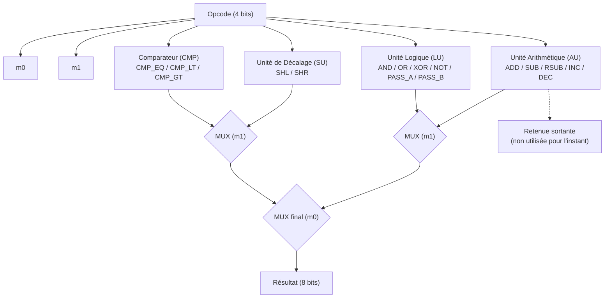

# Thèse : Construction d'un Ordinateur à partir de Zéro (from Scratch)

## Résumé
*Ce document retrace la conception et l'implémentation complète d'une architecture informatique, des portes logiques jusqu'au langage de haut niveau.*

## Table des Matières
1. [Introduction](#introduction)
2. [Couche 0 : Logique Booléenne (Hardware)](#couche-0)
3. [Couche 1 : Arithmétique et ALU](#couche-1)
4. [Couche 2 : Mémoire et Registres](#couche-2)
5. [Couche 3 : Architecture du Processeur (CPU)](#couche-3)
6. [Couche 4 : Machine Virtuelle et Émulation](#couche-4)
7. [Couche 5 : Langage d'Assemblage](#couche-5)
8. [Couche 6 : Compilation et Langage Haut Niveau](#couche-6)
9. [Conclusion](#conclusion)

## Introduction 

Ce projet a pour ambition de construire un ordinateur complet **from scratch**, en partant des portes logiques les plus élémentaires (NAND) pour aboutir, couche après couche, à un langage de programmation de haut niveau. L'objectif n'est pas de produire un système optimisé pour un usage réel, mais de comprendre en profondeur *comment* un ordinateur fonctionne, en construisant chaque abstraction soi-même plutôt que de la considérer comme acquise.

L'approche suivie est **"bottom-up"** : chaque couche s'appuie exclusivement sur les composants validés dans la couche précédente. Ainsi, la logique booléenne (couche 0) sert de fondation à l'arithmétique et à l'ALU (couche 1), qui elle-même servira de base à la mémoire et aux registres (couche 2), et ainsi de suite jusqu'au compilateur.

Deux outils complémentaires sont utilisés tout au long du projet, selon une méthodologie **"Double-Track"** :
- **Logisim**, pour la conception visuelle et la simulation des circuits logiques.
- **Rust**, pour l'émulation logicielle des mêmes composants, permettant de valider leur comportement via des tests unitaires rigoureux (tables de vérité, cas limites, etc.).

## Couche 0 : Logique Booléenne 
L'implémentation de la couche 0 a permis de valider l'universalité de la porte **NAND**. 

### Résultats de la recherche :
1.  **Universalité** : Nous avons prouvé par la pratique que les portes fondamentales (NOT, AND, OR) peuvent être exclusivement construites à partir de portes NAND.
2.  **Routage** : La conception du Multiplexeur (MUX) et du Démultiplexeur (DMUX) a posé les bases de l'aiguillage des signaux, essentiel pour la future Unité de Contrôle.
3.  **Méthodologie** : L'approche "Double-Track" (Logisim + Rust) a permis de confirmer la justesse des circuits avant leur intégration. Les tests unitaires en Rust ont validé 100% des tables de vérité mathématiques.

## Couche 1 : Arithmétique et ALU 
L'implémentation de la couche 1 a permis de construire une Unité Arithmétique et Logique (ALU) 8 bits complète, orchestrant quatre sous-unités (AU, LU, SU, CMP) via un opcode unique de 4 bits, encodant 16 opérations.

### Résultats de la recherche :

1. **Encodage de l'opcode** : Un opcode de 4 bits a été choisi pour coder les 16 opérations supportées (ADD, SUB, RSUB, INC, DEC, AND, OR, XOR, NOT, SHL, SHR, CMP_EQ, CMP_LT, CMP_GT, PASS_A, PASS_B), réparties entre les unités responsables (AU, LU, SU). Cet encodage a été conçu pour que les bits de l'opcode servent directement de sélecteurs de MUX à l'intérieur de chaque sous-unité, sans décodage intermédiaire coûteux.
2. **Unité Arithmétique (AU)** : Construite en assemblant 8 *full adders* en chaîne, elle réalise ADD, SUB, RSUB, INC et DEC à partir d'un même chemin de données, en jouant sur l'inversion conditionnelle des opérandes (complément à deux) et sur la retenue d'entrée, sélectionnées par les 3 premiers bits de l'opcode.
3. **Unité Logique (LU)** : Réalisée bit à bit (puis répliquée sur 8 bits), elle combine AND, OR, XOR, NOT, ainsi que le passage direct de A ou B (PASS_A, PASS_B), via une cascade de MUX imbriqués pilotée par les 4 bits de l'opcode.
4. **Unité de Décalage (SU)** : Réalise SHL et SHR (décalage logique gauche/droite d'un bit), le sens du décalage étant sélectionné par un seul bit de l'opcode.
5. **Comparateur (CMP)** : Comme identifié lors des difficultés du sprint, le CMP fonctionne en propageant deux signaux (égalité et supériorité) d'un bit à l'autre, le résultat final n'étant déterminé qu'au niveau du CMP 8 bits, où l'opcode sélectionne le signal de sortie correspondant (CMP_EQ, CMP_LT, CMP_GT).
6. **Simplification logique (Karnaugh & Gray)** : La table de Karnaugh a permis de dériver simplement les équations de sélection des MUX à partir de l'opcode, en identifiant les regroupements d'opérations partageant un même signal de sélection. Le code de Gray a complété cette démarche en facilitant l'analyse des transitions entre opérations voisines.
7. **Méthodologie** : L'approche "Double-Track" (Logisim + Rust) a de nouveau permis de valider chaque sous-unité indépendamment avant son intégration dans l'ALU finale. Les tests unitaires en Rust ont validé 100% des 16 opérations de la table de vérité de l'ALU. Ce sprint a nécessité 3 semaines au lieu d'une, principalement en raison des corrections apportées au CMP et à l'ALU.

### Schéma de sélection de l'ALU

