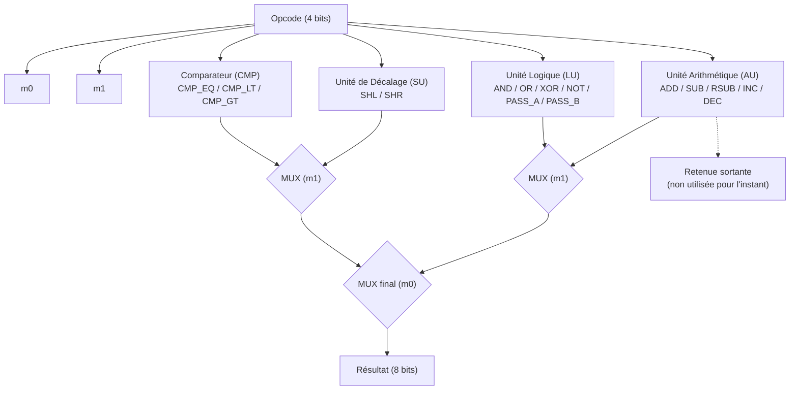
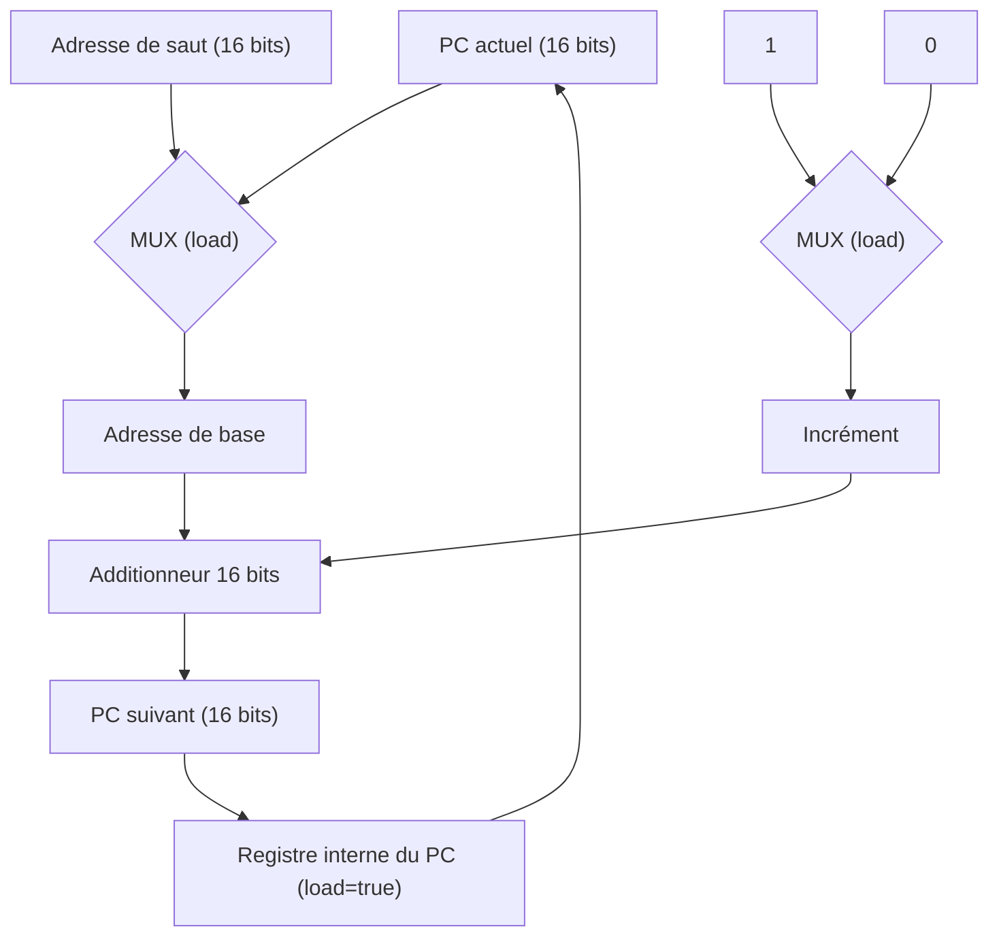
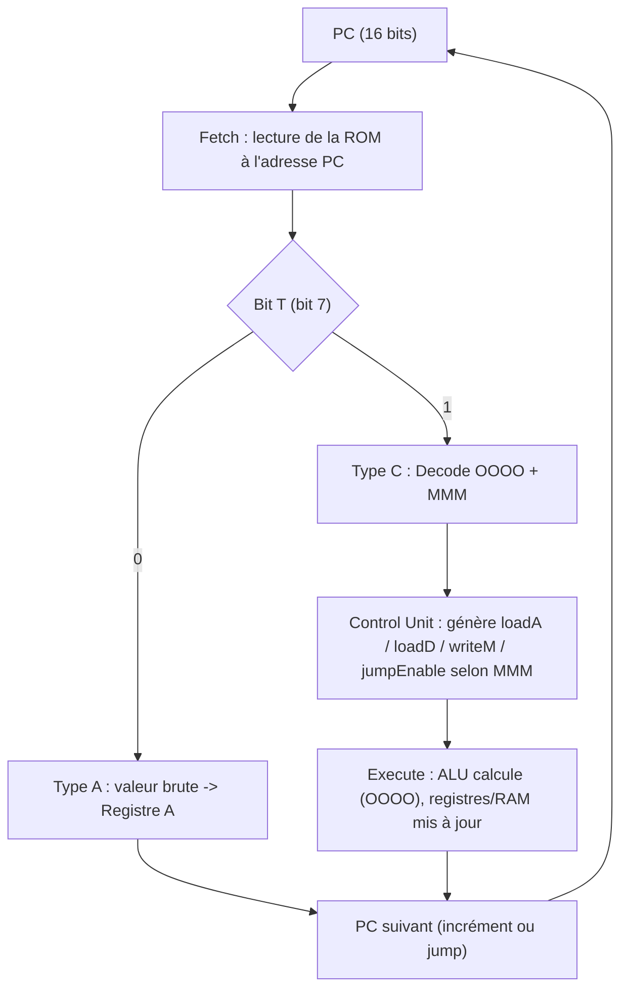

# Thèse : Construction d'un Ordinateur à partir de Zéro (from Scratch)

## Résumé
*Ce document retrace la conception et l'implémentation complète d'une architecture informatique, des portes logiques jusqu'au langage de haut niveau.*

## Table des Matières
1. [Introduction](#introduction)
2. [Couche 0 : Logique Booléenne (Hardware)](#couche-0)
3. [Couche 1 : Arithmétique et ALU](#couche-1)
4. [Couche 2 : Mémoire et Registres](#couche-2)
5. [Couche 3 : Architecture du Processeur (CPU)](#couche-3)
6. [Couche 4 : Machine Virtuelle et Émulation](#couche-4)
7. [Couche 5 : Langage d'Assemblage](#couche-5)
8. [Couche 6 : Compilation et Langage Haut Niveau](#couche-6)
9. [Conclusion](#conclusion)

## Introduction 

Ce projet a pour ambition de construire un ordinateur complet **from scratch**, en partant des portes logiques les plus élémentaires (NAND) pour aboutir, couche après couche, à un langage de programmation de haut niveau. L'objectif n'est pas de produire un système optimisé pour un usage réel, mais de comprendre en profondeur *comment* un ordinateur fonctionne, en construisant chaque abstraction soi-même plutôt que de la considérer comme acquise.

L'approche suivie est **"bottom-up"** : chaque couche s'appuie exclusivement sur les composants validés dans la couche précédente. Ainsi, la logique booléenne (couche 0) sert de fondation à l'arithmétique et à l'ALU (couche 1), qui elle-même servira de base à la mémoire et aux registres (couche 2), et ainsi de suite jusqu'au compilateur.

Deux outils complémentaires sont utilisés tout au long du projet, selon une méthodologie **"Double-Track"** :
- **Logisim**, pour la conception visuelle et la simulation des circuits logiques.
- **Rust**, pour l'émulation logicielle des mêmes composants, permettant de valider leur comportement via des tests unitaires rigoureux (tables de vérité, cas limites, etc.).

## Couche 0 : Logique Booléenne 
L'implémentation de la couche 0 a permis de valider l'universalité de la porte **NAND**.

### Résultats de la recherche :
1.  **Universalité** : Nous avons prouvé par la pratique que les portes fondamentales (NOT, AND, OR) peuvent être exclusivement construites à partir de portes NAND.
2.  **Routage** : La conception du Multiplexeur (MUX) et du Démultiplexeur (DMUX) a posé les bases de l'aiguillage des signaux, essentiel pour la future Unité de Contrôle.
3.  **Méthodologie** : L'approche "Double-Track" (Logisim + Rust) a permis de confirmer la justesse des circuits avant leur intégration. Les tests unitaires en Rust ont validé 100% des tables de vérité mathématiques.

## Couche 1 : Arithmétique et ALU 
L'implémentation de la couche 1 a permis de construire une Unité Arithmétique et Logique (ALU) 8 bits complète, orchestrant quatre sous-unités (AU, LU, SU, CMP) via un opcode unique de 4 bits, encodant 16 opérations.

### Résultats de la recherche :

1. **Encodage de l'opcode** : Un opcode de 4 bits a été choisi pour coder les 16 opérations supportées (ADD, SUB, RSUB, INC, DEC, AND, OR, XOR, NOT, SHL, SHR, CMP_EQ, CMP_LT, CMP_GT, PASS_A, PASS_B), réparties entre les unités responsables (AU, LU, SU). Cet encodage a été conçu pour que les bits de l'opcode servent directement de sélecteurs de MUX à l'intérieur de chaque sous-unité, sans décodage intermédiaire coûteux.
2. **Unité Arithmétique (AU)** : Construite en assemblant 8 *full adders* en chaîne, elle réalise ADD, SUB, RSUB, INC et DEC à partir d'un même chemin de données, en jouant sur l'inversion conditionnelle des opérandes (complément à deux) et sur la retenue d'entrée, sélectionnées par les 3 premiers bits de l'opcode.
3. **Unité Logique (LU)** : Réalisée bit à bit (puis répliquée sur 8 bits), elle combine AND, OR, XOR, NOT, ainsi que le passage direct de A ou B (PASS_A, PASS_B), via une cascade de MUX imbriqués pilotée par les 4 bits de l'opcode.
4. **Unité de Décalage (SU)** : Réalise SHL et SHR (décalage logique gauche/droite d'un bit), le sens du décalage étant sélectionné par un seul bit de l'opcode.
5. **Comparateur (CMP)** : Comme identifié lors des difficultés du sprint, le CMP fonctionne en propageant deux signaux (égalité et supériorité) d'un bit à l'autre, le résultat final n'étant déterminé qu'au niveau du CMP 8 bits, où l'opcode sélectionne le signal de sortie correspondant (CMP_EQ, CMP_LT, CMP_GT).
6. **Simplification logique (Karnaugh & Gray)** : La table de Karnaugh a permis de dériver simplement les équations de sélection des MUX à partir de l'opcode, en identifiant les regroupements d'opérations partageant un même signal de sélection. Le code de Gray a complété cette démarche en facilitant l'analyse des transitions entre opérations voisines.
7. **Méthodologie** : L'approche "Double-Track" (Logisim + Rust) a de nouveau permis de valider chaque sous-unité indépendamment avant son intégration dans l'ALU finale. Les tests unitaires en Rust ont validé 100% des 16 opérations de la table de vérité de l'ALU. Ce sprint a nécessité 3 semaines au lieu d'une, principalement en raison des corrections apportées au CMP et à l'ALU.

### Schéma de sélection de l'ALU

## Couche 2 : Mémoire et Registres 
L'implémentation de la couche 2 a permis d'introduire la notion d'**état** dans l'architecture, jusqu'ici purement combinatoire. Elle repose sur trois composants : un registre générique 8 bits, une unité de RAM de 256 cases, et un Program Counter (PC) reposant sur un registre interne dédié de 16 bits (pour l'adressage de la ROM, voir Couche 3).

### Résultats de la recherche :

1. **Limite de la simulation combinatoire** : la bascule D, brique fondamentale de tout élément mémoire, repose sur une boucle combinatoire une sortie rebouclée sur une entrée qui dépend elle-même de cette sortie. Ce type de circuit séquentiel n'est pas représentable par de simples fonctions pures Rust, qui ne portent aucune notion de temps ni de bouclage. La bascule D n'a donc été conçue que dans Logisim, où le rebouclage physique est possible, et non simulée en Rust.
2. **Construction théorique de la bascule D** : un verrou SR (Set-Reset) se construit à partir de deux portes NOR croisées. Un verrou D en est une version sécurisée : une porte AND est ajoutée devant chaque NOR, ce qui permet de contrôler précisément le moment où l'entrée peut modifier l'état stocké.
3. **Registre** : côté Rust, plutôt que de reconstruire une bascule D à partir de portes logiques, l'état est stocké directement dans une variable, et une méthode `clock_tick(data_in, load, reset)` reproduit le comportement attendu à chaque cycle : conserver la valeur, la remplacer par `data_in` si `load` est actif, ou la remettre à zéro si `reset` est actif reset étant prioritaire sur load. Ce registre générique reste en 8 bits (`Byte`), en cohérence avec le reste de l'architecture (ALU, RAM).
4. **RAM** : composée de 256 cases de 8 bits chacune, adressables individuellement via une adresse de 8 bits. L'écriture (`clock_tick`) et la lecture (`read_output`) ciblent une adresse précise, sans affecter les autres cases mémoire. Cette taille est confirmée et détaillée dans la carte mémoire du langage JUMP ([04-memory-map.md](04-memory-map.md)).
5. **Program Counter (PC)** : contrairement au registre générique et à la RAM, le PC repose sur un registre interne dédié de 16 bits. Ce choix anticipe le besoin de la Couche 3 d'adresser une ROM (mémoire de programme) bien plus grande que la RAM de données jusqu'à 65 536 lignes de code. À chaque cycle, le PC combine deux multiplexeurs et une unité arithmétique pour déterminer l'adresse suivante à charger : soit une adresse de saut fournie explicitement (si `load` est actif), soit l'adresse courante incrémentée de 1 (sinon). Le résultat est ensuite systématiquement chargé dans ce registre interne.
6. **Méthodologie** : comme pour les couches précédentes, chaque composant (`Register`, `Ram`, `PC`) a été validé par des tests unitaires en Rust, couvrant l'initialisation, le chargement, le maintien de la valeur, et la réinitialisation.

> **Note** : le PC (16 bits) et la RAM (8 bits) ont des tailles différentes par conception voir Couche 3 pour le détail de cette architecture à deux espaces mémoire distincts (ROM 16 bits / RAM 8 bits).

### Schéma du Program Counter

## Couche 3 : Architecture du Processeur (CPU) 
L'implémentation de la couche 3 a permis d'assembler l'ALU (Couche 1) et les éléments de mémoire (Couche 2) en un processeur complet, capable d'exécuter un programme de manière autonome via un cycle Fetch/Decode/Execute. Le jeu d'instructions complet (ISA) est spécifié dans [`hardware/cpu/ISA.md`](../../hardware/cpu/ISA.md).

### Résultats de la recherche :

1. **Contrainte des 8 bits et solution par encodage de modes** : sur une instruction de 8 bits, une ALU à 16 opérations nécessite déjà 4 bits d'opcode, plus 1 bit pour distinguer le type d'instruction, ne laissant que 3 bits pour piloter 5 signaux physiques (source de l'entrée B, `loadA`, `loadD`, `writeM`, `jump`). La solution retenue a été de ne pas câbler ces 3 bits directement sur des fils individuels, mais de les traiter comme un sélecteur de **mode d'exécution** : chacune des 8 combinaisons possibles (`000` à `111`) préconfigure un profil matériel complet (source des données, destination du résultat, activation ou non du saut), permettant de couvrir tous les besoins avec seulement 3 bits.

2. **Format de l'instruction** : chaque instruction de 8 bits suit le format `T OOOO MMM`, où `T` (bit 7) définit le type d'instruction, `OOOO` (bits 6-3) encode l'opcode ALU, et `MMM` (bits 2-0) encode le mode d'exécution.

3. **Bit de type (`T`)** : ce bit de poids fort détermine le comportement global du cycle en cours.
   - `T = 0` : instruction de type A (adresse/valeur) l'ALU est désactivée, et les 7 bits restants (`0vvv_vvvv`) sont chargés directement dans le registre A.
   - `T = 1` : instruction de type C (calcul) l'ALU est activée, l'opcode `OOOO` détermine l'opération, et le mode `MMM` dirige les données. L'entrée A de l'ALU est systématiquement reliée au registre D.

4. **Table des modes d'exécution (`MMM`)** : chaque mode définit à la fois la source de l'entrée B de l'ALU (registre A ou `RAM[A]`), la destination du résultat (registre D, registre A, `RAM[A]`, ou aucune), et si une condition de saut est évaluée.

   | Mode | Entrée B | Destination | Saut | Usage |
          |---|---|---|---|---|
   | `000` | Registre A | Registre D | Non | Calcul pur (`D = D + A`) |
   | `001` | RAM[A] | Registre D | Non | Lecture mémoire (`D = D + RAM[A]`) |
   | `010` | Registre A | Registre A | Non | Mise à jour d'adresse (`A = D + A`) |
   | `011` | Registre A | RAM[A] | Non | Écriture mémoire (`RAM[A] = D op A`) |
   | `100` | RAM[A] | RAM[A] | Non | Modification mémoire directe (`RAM[A] = D op RAM`) |
   | `101` | Registre A | Aucune | Oui, si résultat ALU ≠ 0 | Comparer D et A, sauter à A si vrai |
   | `110` | RAM[A] | Aucune | Oui, si résultat ALU ≠ 0 | Comparer D et RAM, sauter à A si vrai |
   | `111` | Registre A | Registre D **et** Registre A | Non | Clonage : copie du résultat dans D et A |

5. **Saut conditionnel** : les modes `101` et `110` sont conçus pour être combinés avec les opcodes de comparaison de l'ALU (`CMP_EQ`, `CMP_LT`, `CMP_GT`). Le saut n'est déclenché que si la sortie de l'ALU est strictement différente de `00000000` condition naturellement remplie par les opérations de comparaison, qui renvoient `11111111` si la condition est vraie.

6. **Aiguillage du registre A** : le multiplexeur en entrée du registre A (choix entre une valeur issue de la ROM ou un résultat de l'ALU) est piloté directement par le bit `T` de la ROM, extrait via un splitter, plutôt que par la Control Unit un choix d'optimisation matérielle évitant de surcharger cette dernière avec un signal déjà disponible directement.

7. **Deux espaces mémoire distincts** : la ROM (programme) est adressée par le PC sur 16 bits (jusqu'à 65 536 lignes de code), tandis que la RAM (données) reste adressée sur 8 bits via le registre A (256 cases). Cette asymétrie a nécessité de revoir les prévisions de gestion de la RAM et de la ROM, notamment pour les sauts, qui restent cantonnés aux 256 premières lignes de la ROM (page zéro).

8. **Séparation adresse / écriture en RAM** : le `JUMP` ne modifie que le Program Counter (position de lecture dans la ROM) et n'intervient pas dans l'écriture en RAM. Pour écrire une donnée en RAM, le registre A sert directement de broche d'adresse : il suffit de charger l'adresse voulue dans A, la donnée dans D, puis d'activer `writeM` (mode `011` ou `100`).

9. **Passage à l'implémentation Rust** : la simulation du CPU sépare clairement l'état (registres, RAM, ROM, PC) de la logique combinatoire (Control Unit, MUX, ALU), l'ensemble étant orchestré séquentiellement dans une méthode `tick()`, qui imite un front d'horloge et enchaîne les étapes Fetch, Decode et Execute.

10. **Méthodologie** : comme pour les couches précédentes, l'approche "Double-Track" (Logisim + Rust) a permis de valider la Control Unit et le cycle d'exécution avant intégration complète du CPU.

### Schéma du cycle Fetch/Decode/Execute

## Couche 4 : Machine Virtuelle et Émulation 
L'implémentation de la couche 4 a permis de construire une Machine Virtuelle (VM) capable d'exécuter le CPU simulé (Couche 3) à haute performance, et de le doter d'entrées/sorties pour interagir avec l'extérieur.

### Résultats de la recherche :

1. **Machine Virtuelle** : conception d'une VM simulant fidèlement le cycle d'horloge du CPU, ses registres, et ses 256 octets de RAM, offrant un environnement d'exécution rapide sans passer par la simulation porte-à-porte de Logisim.
2. **Memory-Mapped I/O** : intégration d'entrées/sorties pilotées directement via la RAM lecture du clavier et affichage graphique (textuel/emoji) en réservant certaines adresses mémoire à ces périphériques plutôt qu'à des données de programme classiques.
3. **Arbitrage de l'espace mémoire** : les 256 octets de RAM disponibles ayant dû être partagés entre les variables du programme, la pile, et les adresses réservées au Memory-Mapped I/O, un découpage précis de cet espace a été nécessaire pour éviter toute saturation ou collision entre ces usages.
4. **Méthodologie** : validation de la VM par l'exécution d'un premier programme bas niveau, manipulant directement la RAM.

### Apprentissages clés

Compréhension concrète du principe du Memory-Mapped I/O : piloter des périphériques (clavier, écran) non pas via des instructions dédiées, mais en lisant/écrivant simplement à des adresses RAM réservées à cet effet le CPU n'a donc pas besoin d'instructions spécifiques pour l'I/O, seulement d'un espace mémoire bien découpé.

---

## Couche 5 : Langage d'Assemblage 
La couche 5 a permis de créer un assembleur, premier outil logiciel permettant de programmer le CPU sans écrire directement les instructions en binaire.

### Résultats de la recherche :

1. **Assembleur** : implémentation en Rust d'un parseur traduisant des mnémoniques textuels (assembleur) en instructions binaires 8 bits, conformes à l'ISA défini en Couche 3.
2. **Premier programme exécuté** : validation de la chaîne complète (assembleur → binaire → VM → CPU simulé) par l'exécution réussie d'un programme *Hello World*, écrivant une chaîne ASCII en mémoire.
3. **Facilité de mise en œuvre** : contrairement aux couches précédentes, la traduction assembleur → binaire et son exécution se sont mises en place sans difficulté majeure, la logique de correspondance mnémonique → opcode/mode découlant directement de l'ISA déjà spécifié.

### Apprentissages clés

Manipulation concrète du fonctionnement d'un assembleur : comment un texte lisible par un humain (mnémoniques) se traduit mécaniquement en instructions binaires exploitables par le CPU, et comment ce processus s'articule avec le cycle d'exécution bas niveau déjà construit.

## Couche 6 : Compilation et Langage Haut Niveau 
La couche 6 a permis de construire un compilateur complet pour un mini-langage de programmation propre, nommé **JUMP**, capable de traduire un code source de haut niveau en instructions assembleur (Couche 5), exécutables sur le CPU simulé.

### Résultats de la recherche :

1. **Spécification du langage JUMP** : rédaction de la grammaire et de la syntaxe exacte du langage, intégrée à la documentation du projet (mdBook).
2. **Analyse lexicale (Lexer)** : implémentation en Rust d'un Lexer découpant un fichier source JUMP en un vecteur de `Tokens` typés première étape classique de tout pipeline de compilation, transformant un flux de caractères brut en unités lexicales structurées (mots-clés, identifiants, opérateurs, littéraux, etc.).
3. **Memory-Mapped I/O** : intégration au niveau de la VM (voir Couche 4), avec un découpage précis des 256 octets de RAM entre variables, pile et adresses réservées à l'I/O.
4. **Structures de l'AST** : définition en Rust des énumérations `Program`, `Stmt`, `Expr` et `BinaryOperator`, formant la structure hiérarchique du langage JUMP. Seuls les éléments porteurs de sens logique y figurent les points-virgules, parenthèses, ou la fin de fichier (`EOF`), purement syntaxiques, n'ont pas leur place dans l'arbre.
5. **Analyse syntaxique (Parser)** : implémentation d'un Parser à **descente récursive**, qui consomme le flux de Tokens produit par le Lexer pour construire l'AST. Le code a été factorisé via une fonction `parse_block()` dédiée à la lecture du contenu entre accolades, et un mapping optimisé pour la résolution des opérateurs mathématiques et de leur priorité.
6. **Grammaire sans parenthèses obligatoires** : les conditions (`if`) et boucles (`while`) suivent une syntaxe proche de Rust, sans parenthèses imposées autour de la condition.
7. **Séparation Statements / Expressions** : délimitation stricte entre les instructions (`Statements`, qui exécutent une action, comme une assignation ou une boucle) et les expressions (`Expressions`, qui produisent une valeur, comme une opération arithmétique), afin de structurer le Parser proprement et éviter les conflits logiques.
8. **Contrainte matérielle sur le design du langage** : la V1 de JUMP ne gère pas les arguments de fonctions, en raison de l'absence de pile (stack) matérielle sur le CPU 8 bits (Couche 3). Les fonctions (`fn`) restent donc de simples macros d'inlining, sans paramètres.
9. **Génération de code (`codegen.rs`)** : parcours complet de l'AST et traduction en instructions assembleur, couvrant les variables, boucles, conditions, fonctions inlinées et opérations binaires.
10. **Table des symboles et allocation mémoire** : attribution automatique d'une adresse RAM à chaque variable déclarée (`let`), l'espace utilisateur étant volontairement limité à l'adresse 119 pour préserver la zone réservée à l'OS et au Memory-Mapped I/O (voir carte mémoire, Couche 4).
11. **Backpatching et optimisation des sauts** : résolution différée des adresses de saut (une fois la position finale de la cible connue dans le flux d'instructions généré), combinée à une exploitation directe des opcodes de l'ALU (`SHL`, `INC`) pour optimiser certains calculs d'adresse.
12. **Automatisation du pipeline** : le compilateur invoque directement l'assembleur via un sous-processus (`Command`), automatisant entièrement la chaîne source JUMP → binaire exécutable, sans étape manuelle intermédiaire.
13. **Méthodologie** : validation de la chaîne complète Lexer → Parser → Codegen → Assembleur → VM par la compilation et l'exécution réussies de programmes de test (boucle `while`, écriture en RAM).

### Difficultés rencontrées

- **Changement de paradigme (Parser)** : passage d'une analyse linéaire (liste de Tokens produite par le Lexer) à la construction d'une structure hiérarchique et imbriquée (l'AST), nécessitant une bonne maîtrise des appels de fonctions récursives.
- **Ambiguïtés syntaxiques (Parser)** : distinction entre la consommation définitive d'un jeton (`advance`/`consume`) et l'anticipation du jeton suivant sans le consommer (`peek`), nécessaire par exemple pour déterminer si un identifiant est suivi d'un `=` (assignation) ou d'une `(` (appel de fonction), avant de décider comment le traiter.
- **Frontière Statements / Expressions (Parser)** : nécessité de délimiter clairement ces deux catégories dès la conception du Parser pour éviter les conflits logiques par la suite.
- **Limite d'adressage à 127 par instruction `VAL`** : une instruction de type A (`VAL`) encode une valeur immédiate sur 7 bits seulement (bit 7 réservé au choix nombre/calcul, voir Couche 3), ce qui ne permet pas de charger directement une adresse ou une valeur supérieure à 127 en une seule instruction. Or la RAM compte 256 cases : sans solution, seule la moitié inférieure (adresses 0 à 127) aurait été directement accessible en écriture/lecture.
   - **Solution exploitée** : le câblage fixe de l'entrée A de l'ALU sur le registre D (choix de conception de la Couche 3) permet d'enchaîner un `SHL` (décalage à gauche, équivalent à une multiplication par 2) directement sur D. En combinant plusieurs `VAL` (valeurs ≤ 127) avec des `SHL`/additions successives, il devient possible de construire, par calcul, des valeurs supérieures à 127 directement dans les registres et donc d'atteindre l'intégralité des 256 cases de la RAM malgré la limite d'encodage des instructions.
- **Paradoxe des sauts conditionnels** : le calcul de l'adresse cible d'un saut écrasait par inadvertance le registre `D`, qui stockait pourtant le résultat de la condition à évaluer nécessitant de réordonner soigneusement les instructions générées pour ne pas perdre cette valeur avant son utilisation.
- **Limite de 127 instructions en ROM** : contrainte structurelle liée au même codage 7 bits des valeurs immédiates de l'instruction `VAL`, limitant la taille des programmes compilables sans stratégie de contournement supplémentaire.
- **Mapping opérateurs haut niveau → opcodes ALU** : structuration de la génération de code pour traduire proprement chaque opérateur du langage JUMP vers l'opcode ALU correspondant, sans corrompre l'état des registres ni la pile d'exécution simulée par le compilateur.

### Apprentissages clés

- Séparation stricte des responsabilités entre les étapes du pipeline : le Parser vérifie la grammaire et construit l'AST, le Générateur de Code gère la logique et la sémantique.
- L'AST est une représentation épurée du programme : seuls les éléments porteurs de sens logique y figurent, la syntaxe pure (ponctuation, délimiteurs) étant consommée et éliminée par le Parser.
- La conception d'un langage doit composer avec les contraintes du matériel sous-jacent : l'absence de pile d'exécution sur le CPU a directement orienté le choix de ne pas supporter les arguments de fonctions ; la limite d'encodage à 7 bits des valeurs immédiates a nécessité une technique de construction de nombres par calcul (`SHL`) pour rester compatible avec l'ensemble de l'espace RAM.
- Maîtrise concrète de la contrainte de « Zero-Page » et de la segmentation mémoire, déjà entrevue en Couche 3-4 mais pleinement exploitée ici dans la génération de code.
- Rigueur nécessaire à l'écriture d'un compilateur de bout en bout : chaque instruction générée a un impact direct et immédiat sur la machine virtuelle et le comportement matériel une erreur de génération (comme l'écrasement du registre D) se traduit directement par un bug d'exécution difficile à tracer sans redescendre au niveau assembleur.
- Application du principe DRY (*Don't Repeat Yourself*) en architecturant une toolchain modulaire interconnectée (Lexer, Parser, Codegen, Assembleur, VM), chaque étape restant indépendante et testable isolément.

### Schéma de la chaîne d'outils complète

## Conclusion 
*(Section provisoire à compléter au fil des prochains sprints.)*

À ce stade du projet, les sept couches de l'architecture ont été franchies, depuis la porte NAND jusqu'à un compilateur fonctionnel pour un langage de haut niveau propre (JUMP), capable de générer et d'exécuter des programmes de bout en bout sur le matériel simulé. L'approche bottom-up et la méthodologie "Double-Track" (Logisim + Rust) se sont révélées efficaces pour valider chaque couche indépendamment avant de l'intégrer dans la suivante, et pour détecter rapidement les erreurs de conception (voir par exemple la correction du comparateur en Couche 1).

Les difficultés rencontrées ont majoritairement porté sur des points de passage entre niveaux d'abstraction : la limite de la simulation purement combinatoire face à la logique séquentielle (Couche 2), la compression de plusieurs signaux de contrôle sur un nombre de bits restreint (Couche 3), l'arbitrage d'un espace mémoire limité entre plusieurs usages concurrents (Couche 4), le changement de paradigme d'une analyse linéaire à une structure arborescente récursive (Couche 6, Parser), et la nécessité de contourner par calcul les limites d'encodage des instructions pour couvrir l'intégralité de l'espace mémoire (Couche 6, génération de code).

### Si c'était à refaire

Plusieurs contraintes rencontrées tout au long du projet découlent directement du choix initial d'une architecture strictement 8 bits : la plage de valeurs immédiates limitée à 7 bits (0-127), l'espace RAM réduit à 256 cases, et les techniques de contournement nécessaires pour malgré tout adresser l'intégralité de la mémoire (voir Couche 6). Si le projet était repris depuis le début, l'architecture serait conçue **en 16 bits au minimum** de bout en bout (bus de données, registres, immédiats), ce qui aurait supprimé la majorité de ces contraintes de contournement sans changer la démarche pédagogique du projet. Une architecture alternative (par exemple avec une pile matérielle dédiée, pour lever la limitation actuelle sur les arguments de fonctions) pourrait également être envisagée pour pallier plus largement l'ensemble des limitations identifiées au fil des sprints.

La suite immédiate du projet consiste à enrichir et fiabiliser le langage JUMP (gestion d'arguments de fonctions si une pile matérielle est ajoutée, optimisations du générateur de code) et à documenter des exemples de programmes complets (jeu, démonstrations graphiques) exploitant la chaîne d'outils construite de bout en bout.