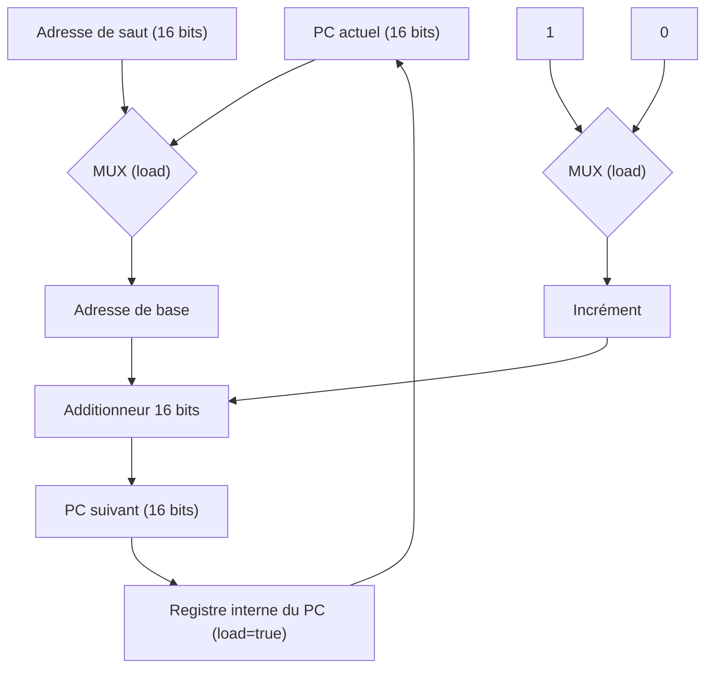

# Couche 2 : Mémoire et Registres
L'implémentation de la couche 2 a permis d'introduire la notion d'**état** dans l'architecture, jusqu'ici purement combinatoire. Elle repose sur trois composants : un registre générique 8 bits, une unité de RAM de 256 cases, et un Program Counter (PC) reposant sur un registre interne dédié de 16 bits (pour l'adressage de la ROM, voir Couche 3).

### Résultats de la recherche :

1. **Limite de la simulation combinatoire** : la bascule D, brique fondamentale de tout élément mémoire, repose sur une boucle combinatoire une sortie rebouclée sur une entrée qui dépend elle-même de cette sortie. Ce type de circuit séquentiel n'est pas représentable par de simples fonctions pures Rust, qui ne portent aucune notion de temps ni de bouclage. La bascule D n'a donc été conçue que dans Logisim, où le rebouclage physique est possible, et non simulée en Rust.
2. **Construction théorique de la bascule D** : un verrou SR (Set-Reset) se construit à partir de deux portes NOR croisées. Un verrou D en est une version sécurisée : une porte AND est ajoutée devant chaque NOR, ce qui permet de contrôler précisément le moment où l'entrée peut modifier l'état stocké.
3. **Registre** : côté Rust, plutôt que de reconstruire une bascule D à partir de portes logiques, l'état est stocké directement dans une variable, et une méthode `clock_tick(data_in, load, reset)` reproduit le comportement attendu à chaque cycle : conserver la valeur, la remplacer par `data_in` si `load` est actif, ou la remettre à zéro si `reset` est actif reset étant prioritaire sur load. Ce registre générique reste en 8 bits (`Byte`), en cohérence avec le reste de l'architecture (ALU, RAM).
4. **RAM** : composée de 256 cases de 8 bits chacune, adressables individuellement via une adresse de 8 bits. L'écriture (`clock_tick`) et la lecture (`read_output`) ciblent une adresse précise, sans affecter les autres cases mémoire. Cette taille est confirmée et détaillée dans la carte mémoire du langage JUMP ([04-memory-map.md](04-memory-map.md)).
5. **Program Counter (PC)** : contrairement au registre générique et à la RAM, le PC repose sur un registre interne dédié de 16 bits. Ce choix anticipe le besoin de la Couche 3 d'adresser une ROM (mémoire de programme) bien plus grande que la RAM de données jusqu'à 65 536 lignes de code. À chaque cycle, le PC combine deux multiplexeurs et une unité arithmétique pour déterminer l'adresse suivante à charger : soit une adresse de saut fournie explicitement (si `load` est actif), soit l'adresse courante incrémentée de 1 (sinon). Le résultat est ensuite systématiquement chargé dans ce registre interne.
6. **Méthodologie** : comme pour les couches précédentes, chaque composant (`Register`, `Ram`, `PC`) a été validé par des tests unitaires en Rust, couvrant l'initialisation, le chargement, le maintien de la valeur, et la réinitialisation.

> **Note** : le PC (16 bits) et la RAM (8 bits) ont des tailles différentes par conception voir Couche 3 pour le détail de cette architecture à deux espaces mémoire distincts (ROM 16 bits / RAM 8 bits).

### Schéma du Program Counter

## Spécification de la Mémoire (Couche 2)

Ce document détaille l'introduction de la notion d'**état** dans l'architecture, jusqu'ici purement combinatoire (Couches 0 et 1). Trois composants sont couverts : le registre générique, la RAM, et le Program Counter (PC).

## 1. Logique Séquentielle vs Logique Combinatoire

Toutes les couches précédentes reposaient sur des circuits **combinatoires** : la sortie ne dépend que des entrées présentes, sans mémoire du passé. Un registre, à l'inverse, doit **retenir** une valeur dans le temps — il s'agit de logique **séquentielle**.

L'élément de base de toute mémoire est la **bascule D**, elle-même construite à partir de **verrous** (latch) :

- **Verrou SR** (Set-Reset) : construit à partir de deux portes NOR croisées, où la sortie de chaque porte est reboucaisée sur l'entrée de l'autre.
- **Verrou D** : version sécurisée du verrou SR, où une porte AND est ajoutée devant chaque NOR afin de contrôler précisément le moment où l'entrée est autorisée à modifier l'état stocké.

**Particularité** : le rebouclage d'une sortie sur une entrée qui dépend d'elle-même est un circuit à boucle combinatoire. Ce type de circuit est physiquement réalisable (Logisim), mais **non représentable par de simples fonctions pures** telles qu'utilisées dans notre émulation Rust jusqu'ici (une fonction pure ne peut pas dépendre de sa propre sortie). C'est pourquoi la bascule D est conçue et documentée uniquement au niveau du schéma Logisim, et n'est pas reconstruite porte par porte dans l'émulation Rust.

En Rust, l'état est donc représenté directement par une variable, et une méthode `clock_tick` simule le comportement observable d'une bascule à chaque cycle d'horloge (charger / conserver / réinitialiser), sans reconstruire le bouclage physique sous-jacent.

## 2. Registre (`Register`)

Le registre générique stocke une valeur de 8 bits (`Byte`). À chaque cycle (`clock_tick`), son comportement suit une priorité stricte : **reset > load > maintien**.

**Table de sélection :**

| `reset` | `load` | Valeur à `t+1` |
|---|---|---|
| 1 | x | `00000000` |
| 0 | 1 | `data_in` |
| 0 | 0 | valeur inchangée (`value(t)`) |

**Équation :**
$$ value(t{+}1) = MUX\big(MUX(value(t),\ data\_in,\ load),\ 0,\ reset\big) $$

## 3. Mémoire Vive (`Ram`)

La RAM est un ensemble de cases mémoire de 8 bits (`Byte`), chacune adressable individuellement. L'adresse est portée sur 16 bits, ce qui permet d'adresser $2^{16} = 65\,536$ cases — bien plus que les 256 cases obtenues avec une adresse 8 bits.

**Comportement :**
- **Lecture** (`read_output(address)`) : retourne la valeur stockée à `address`, sans effet de bord.
- **Écriture** (`clock_tick(address, data_in, load)`) : si `load` est actif, remplace la valeur à `address` par `data_in` ; sinon, la mémoire reste inchangée. Une écriture à une adresse donnée n'affecte aucune autre case.

> **Note d'implémentation** : le code fourni initialement utilisait une adresse 8 bits (256 cases). Le passage à une adresse 16 bits (65 536 cases) nécessite d'adapter le type d'adresse (`Byte` → un type 16 bits, ex. `Byte16` ou équivalent) et la taille du tableau interne (`[Byte; 65536]`). Si ce n'est pas encore fait côté code, il faudra qu'on l'adapte.

## 4. Compteur de Programme (`PC`)

Le PC repose sur un registre interne **dédié de 16 bits** (distinct du registre générique 8 bits), nécessaire pour pouvoir adresser l'intégralité de l'espace mémoire de la RAM (65 536 cases).

À chaque cycle, le PC calcule sa prochaine valeur en deux étapes :

1. **Sélection de l'adresse de base** : selon `load`, on choisit entre l'adresse courante (`load = 0`) et l'adresse de saut fournie (`load = 1`).
   $$ base = MUX(PC_{actuel},\ adresse\_saut,\ load) $$

2. **Sélection de l'incrément** : selon `load`, on ajoute soit 1 (cas normal, pas de saut), soit 0 (cas d'un saut, l'adresse de saut est utilisée telle quelle).
   $$ incr\acute{e}ment = MUX(1,\ 0,\ load) $$

3. **Calcul final** : la valeur suivante est obtenue en additionnant `base` et `incrément`, puis chargée systématiquement (`load = true`) dans le registre interne du PC.
   $$ PC_{suivant} = base + incr\acute{e}ment $$
   $$ registre\_interne \leftarrow PC_{suivant} \quad (load = 1) $$

**Table de comportement observable :**

| `load` | `reset` | Comportement |
|---|---|---|
| 0 | 0 | `PC_suivant = PC_actuel + 1` (incrémentation normale) |
| 1 | 0 | `PC_suivant = adresse_saut` (saut) |
| x | 1 | `PC_suivant = 0` (réinitialisation, prioritaire) |

> **Note d'implémentation** : de même que pour la RAM, l'adressage du PC sur 16 bits nécessite que l'additionneur utilisé (actuellement `au8`, 8 bits) soit remplacé par une version 16 bits, ou que deux `au8` soient chaînés avec propagation de retenue.

### Schéma du Program Counter

### Méthodologie de validation

Comme pour les couches précédentes, chaque composant (`Register`, `Ram`, `PC`) a été validé par des tests unitaires en Rust, couvrant l'initialisation, le chargement, le maintien de la valeur, et la réinitialisation.