# Couche 6 : Compilation et Langage Haut Niveau
La couche 6 a permis de construire un compilateur complet pour un mini-langage de programmation propre, nommé **JUMP**, capable de traduire un code source de haut niveau en instructions assembleur (Couche 5), exécutables sur le CPU simulé.

### Résultats de la recherche :

1. **Spécification du langage JUMP** : rédaction de la grammaire et de la syntaxe exacte du langage, intégrée à la documentation du projet (mdBook).
2. **Analyse lexicale (Lexer)** : implémentation en Rust d'un Lexer découpant un fichier source JUMP en un vecteur de `Tokens` typés — première étape classique de tout pipeline de compilation, transformant un flux de caractères brut en unités lexicales structurées (mots-clés, identifiants, opérateurs, littéraux, etc.).
3. **Memory-Mapped I/O** : intégration au niveau de la VM (voir Couche 4), avec un découpage précis des 256 octets de RAM entre variables, pile et adresses réservées à l'I/O.
4. **Structures de l'AST** : définition en Rust des énumérations `Program`, `Stmt`, `Expr` et `BinaryOperator`, formant la structure hiérarchique du langage JUMP. Seuls les éléments porteurs de sens logique y figurent : les points-virgules, parenrecherches, ou la fin de fichier (`EOF`), purement syntaxiques, n'ont pas leur place dans l'arbre.
5. **Analyse syntaxique (Parser)** : implémentation d'un Parser à **descente récursive**, qui consomme le flux de Tokens produit par le Lexer pour construire l'AST. Le code a été factorisé via une fonction `parse_block()` dédiée à la lecture du contenu entre accolades, et un mapping optimisé pour la résolution des opérateurs mathématiques et de leur priorité.
6. **Grammaire sans parenrecherches obligatoires** : les conditions (`if`) et boucles (`while`) suivent une syntaxe proche de Rust, sans parenrecherches imposées autour de la condition.
7. **Séparation Statements / Expressions** : délimitation stricte entre les instructions (`Statements`, qui exécutent une action, comme une assignation ou une boucle) et les expressions (`Expressions`, qui produisent une valeur, comme une opération arithmétique), afin de structurer le Parser proprement et éviter les conflits logiques.
8. **Contrainte matérielle sur le design du langage** : la V1 de JUMP ne gère pas les arguments de fonctions, en raison de l'absence de pile (stack) matérielle sur le CPU 8 bits (Couche 3). Les fonctions (`fn`) restent donc de simples macros d'inlining, sans paramètres.
9. **Génération de code (`codegen.rs`)** : parcours complet de l'AST et traduction en instructions assembleur, couvrant les variables, boucles, conditions, fonctions inlinées et opérations binaires.
10. **Table des symboles et allocation mémoire** : attribution automatique d'une adresse RAM à chaque variable déclarée (`let`), l'espace utilisateur étant volontairement limité à l'adresse 119 pour préserver la zone réservée à l'OS et au Memory-Mapped I/O (voir carte mémoire, Couche 4).
11. **Backpatching et optimisation des sauts** : résolution différée des adresses de saut (une fois la position finale de la cible connue dans le flux d'instructions généré), combinée à une exploitation directe des opcodes de l'ALU (`SHL`, `INC`) pour optimiser certains calculs d'adresse.
12. **Automatisation du pipeline** : le compilateur invoque directement l'assembleur via un sous-processus (`Command`), automatisant entièrement la chaîne source JUMP → binaire exécutable, sans étape manuelle intermédiaire.
13. **Développement de l'application finale "Le Télécran"** : conception et exécution réussies d'une application de dessin interactive. Le programme lit en temps réel les frappes du clavier (touches Z, Q, S, D) via `peek(127)` et déplace un curseur pour dessiner sur l'écran via `poke(..., 4)` avec un caractère matériel dédié. Cette application valide l'ensemble de la chaîne de compilation et du matériel simulé (NAND to Game).

### Difficultés rencontrées

* **Changement de paradigme (Parser)** : passage d'une analyse linéaire (liste de Tokens produite par le Lexer) à la construction d'une structure hiérarchique et imbriquée (l'AST), nécessitant une bonne maîtrise des appels de fonctions récursives.
* **Ambiguïtés syntaxiques (Parser)** : distinction entre la consommation définitive d'un jeton (`advance`/`consume`) et l'anticipation du jeton suivant sans le consommer (`peek`), nécessaire par exemple pour déterminer si un identifiant est suivi d'un `=` (assignation) ou d'une `(` (appel de fonction), avant de décider comment le traiter.
* **Frontière Statements / Expressions (Parser)** : nécessité de délimiter clairement ces deux catégories dès la conception du Parser pour éviter les conflits logiques par la suite.
* **Limite d'adressage à 127 par instruction `VAL**` : une instruction de type A (`VAL`) encode une valeur immédiate sur 7 bits seulement (bit 7 réservé au choix nombre/calcul, voir Couche 3), ce qui ne permet pas de charger directement une adresse ou une valeur supérieure à 127 en une seule instruction. Or la RAM compte 256 cases : sans solution, seule la moitié inférieure (adresses 0 à 127) aurait été directement accessible en écriture/lecture.
* *Solution exploitée* : le câblage fixe de l'entrée A de l'ALU sur le registre D (choix de conception de la Couche 3) permet d'enchaîner un `SHL` (décalage à gauche, équivalent à une multiplication par 2) directement sur D. En combinant plusieurs `VAL` (valeurs ≤ 127) avec des `SHL`/additions successives, il devient possible de construire, par calcul, des valeurs supérieures à 127 directement dans les registres et donc d'atteindre l'intégralité des 256 cases de la RAM malgré la limite d'encodage des instructions.

* **Paradoxe des sauts conditionnels** : le calcul de l'adresse cible d'un saut écrasait par inadvertance le registre `D`, qui stockait pourtant le résultat de la condition à évaluer — nécessitant de réordonner soigneusement les instructions générées pour ne pas perdre cette valeur avant son utilisation.
* **Le mur de la ROM (Limite de 127 instructions)** : contrainte structurelle liée au même codage 7 bits des adresses, plafonnant strictement la taille de n'importe quel programme à 127 lignes d'assembleur. Cette limite physique absolue a provoqué des crashs du compilateur lors des tentatives de développement de jeux complexes (Snake, Pong) nécessitant de multiples conditions `if`.
* *Pivot matériel* : Le matériel dictant le logiciel, cela a forcé un pivot de *Game Design* vers le "Télécran" (Etch-A-Sketch), une application beaucoup plus légère qui économise des dizaines d'instructions en supprimant la logique de collision complexe et en s'épargnant l'effacement du curseur (moins de 90 instructions au final).

* **Mapping opérateurs haut niveau → opcodes ALU** : structuration de la génération de code pour traduire proprement chaque opérateur du langage JUMP vers l'opcode ALU correspondant, sans corrompre l'état des registres ni la pile d'exécution simulée par le compilateur.

### Apprentissages clés

* Séparation stricte des responsabilités entre les étapes du pipeline : le Parser vérifie la grammaire et construit l'AST, le Générateur de Code gère la logique et la sémantique.
* L'AST est une représentation épurée du programme : seuls les éléments porteurs de sens logique y figurent, la syntaxe pure (ponctuation, délimiteurs) étant consommée et éliminée par le Parser.
* La conception d'un langage doit composer avec les contraintes du matériel sous-jacent : l'absence de pile d'exécution sur le CPU a directement orienté le choix de ne pas supporter les arguments de fonctions ; la limite d'encodage à 7 bits des valeurs immédiates a nécessité une technique de construction de nombres par calcul (`SHL`) pour rester compatible avec l'ensemble de l'espace RAM.
* Maîtrise concrète de la contrainte de « Zero-Page » et de la segmentation mémoire, déjà entrevue en Couche 3-4 mais pleinement exploitée ici dans la génération de code.
* Rigueur nécessaire à l'écriture d'un compilateur de bout en bout : chaque instruction générée a un impact direct et immédiat sur la machine virtuelle et le comportement matériel ; une erreur de génération (comme l'écrasement du registre D) se traduit directement par un bug d'exécution difficile à tracer sans redescendre au niveau assembleur.
* Application du principe DRY (*Don't Repeat Yourself*) en architecturant une toolchain modulaire interconnectée (Lexer, Parser, Codegen, Assembleur, VM), chaque étape restant indépendante et testable isolément.

### Schéma de la chaîne d'outils complète

```mermaid
flowchart LR
    SRC["Code source JUMP (.jmp)"] --> LEX["Lexer -> Tokens"]
    LEX --> PARSE["Parser -> AST"]
    PARSE --> ALLOC["Allocateur mémoire (table des symboles)"]
    ALLOC --> CODEGEN["Génération de code (codegen.rs)"]
    CODEGEN --> ASM["Assembleur (mnémoniques -> binaire)"]
    ASM --> ASSEMBLEUR["Appel automatisé de l'Assembleur"]
    ASSEMBLEUR --> BIN["Binaire exécutable (.bin)"]
    BIN --> VM["Machine Virtuelle"]
    VM --> CPU["CPU simulé (Couche 3)"]
    CPU --> RAM["RAM 256 octets + Memory-Mapped I/O"]

```

