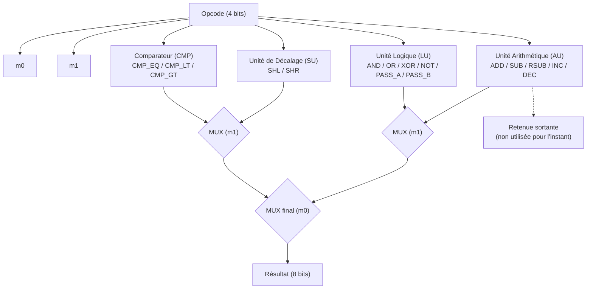

# Spécification de l'Unité Arithmétique et Logique (Couche 1)

Ce document détaille l'implémentation de l'Unité Arithmétique et Logique (ALU) 8 bits, construite au-dessus de la logique combinatoire de la Couche 0. L'ALU combine quatre sous-unités — arithmétique (AU), logique (LU), décalage (SU) et comparaison (CMP) — orchestrées par un opcode unique de 4 bits encodant 16 opérations.

## 1. Circuits Élémentaires d'Addition

### Demi-additionneur (Half Adder)

Le demi-additionneur additionne deux bits et produit une somme et une retenue.

**Équations :**
$$ S = A \oplus B $$
$$ C = A \cdot B $$

**Table de vérité :**

| A | B | S | C |
|---|---|---|---|
| 0 | 0 | 0 | 0 |
| 0 | 1 | 1 | 0 |
| 1 | 0 | 1 | 0 |
| 1 | 1 | 0 | 1 |

### Additionneur Complet (Full Adder)

L'additionneur complet étend le demi-additionneur en prenant en compte une retenue entrante $C_{in}$, en chaînant deux demi-additionneurs.

**Équations :**
$$ S = A \oplus B \oplus C_{in} $$
$$ C_{out} = (A \cdot B) + (C_{in} \cdot (A \oplus B)) $$

**Table de vérité :**

| A | B | C_in | S | C_out |
|---|---|------|---|-------|
| 0 | 0 | 0 | 0 | 0 |
| 1 | 0 | 0 | 1 | 0 |
| 0 | 1 | 0 | 1 | 0 |
| 0 | 0 | 1 | 1 | 0 |
| 1 | 1 | 0 | 0 | 1 |
| 1 | 0 | 1 | 0 | 1 |
| 0 | 1 | 1 | 0 | 1 |
| 1 | 1 | 1 | 1 | 1 |

## 2. Unité Arithmétique (AU)

L'AU réalise cinq opérations arithmétiques (ADD, SUB, RSUB, INC, DEC) sur 8 bits, à partir d'une seule chaîne de 8 additionneurs complets (retenue propagée du bit 0, LSB, jusqu'au bit 7, MSB). Un opcode de 3 bits sélectionne l'opération en pilotant, pour chaque opérande, une inversion conditionnelle (complément à deux) ainsi que la retenue d'entrée.

**Table de sélection :**

| Opcode (bit2 bit1 bit0) | Opération | Entrée A' | Entrée B' | Retenue initiale |
|---|---|---|---|---|
| 000 | ADD (A + B) | A | B | 0 |
| 001 | SUB (A - B) | A | ¬B | 1 |
| 010 | RSUB (B - A) | ¬A | B | 1 |
| 011 | INC (A + 1) | A | 00000001 | 0 |
| 100 | DEC (A - 1) | A | ¬(00000001) | 1 |

Le résultat de chaque opération est obtenu en calculant $A' + B' + C_{in}$ à travers la chaîne d'additionneurs. Les cas SUB, RSUB et DEC exploitent le principe du **complément à deux** : soustraire B revient à additionner ¬B et une retenue initiale de 1.

La retenue sortante finale ($C_{out}$ du dernier additionneur, bit 7) est renvoyée telle quelle et n'a de signification que pour les opérations de cette unité.

## 3. Unité Logique (LU)

La LU réalise six opérations logiques (AND, OR, XOR, NOT, PASS_A, PASS_B) sur un bit, répliquée sur 8 bits en parallèle (aucune propagation entre bits). La sélection repose sur un arbre de multiplexeurs à trois niveaux, piloté par trois signaux dérivés de l'opcode 4 bits :

$$ mux_0 = \text{NOT} + \text{PASS\_B} + \text{OR} $$
$$ mux_1 = \text{XOR} + \text{PASS\_A} + \text{NOT} + \text{PASS\_B} $$
$$ mux_2 = \text{PASS\_A} + \text{PASS\_B} $$

où chaque terme (NOT, OR, XOR, etc.) vaut 1 exactement pour l'opcode correspondant. Ces trois signaux suffisent à sélectionner l'une des 6 opérations, sans décodage explicite intermédiaire :

**Table de vérité (par opération) :**

| Opcode | Opération | Sortie |
|---|---|---|
| 0101 | AND | $A \cdot B$ |
| 0110 | OR | $A + B$ |
| 0111 | XOR | $A \oplus B$ |
| 1000 | NOT | $\overline{A}$ |
| 1110 | PASS_A | $A$ |
| 1111 | PASS_B | $B$ |

## 4. Unité de Décalage (SU)

La SU effectue un décalage logique d'un bit vers la gauche (SHL) ou la droite (SHR), sélectionné par un unique bit d'opcode. Chaque bit de sortie est un multiplexeur entre le bit voisin de poids inférieur et le bit voisin de poids supérieur ; les bits entrants (position 0 en SHL, position 7 en SHR) sont mis à zéro.

**Équations (par position i, opcode = sens du décalage) :**
$$ S_i = MUX(A_{i-1},\ A_{i+1},\ opcode) $$

avec $A_{-1} = 0$ (SHL) et $A_{8} = 0$ (SHR).

**Table de sélection :**

| Opcode | Opération | Effet |
|---|---|---|
| 0 | SHL | $A \ll 1$ (bit 7 perdu, bit 0 mis à 0) |
| 1 | SHR | $A \gg 1$ (bit 0 perdu, bit 7 mis à 0) |

## 5. Comparateur (CMP)

### Comparateur 1 bit

Le comparateur 1 bit propage deux signaux d'un bit à l'autre : l'égalité cumulée (`eq`) et la supériorité cumulée (`ct`, "A déjà supérieur à B").

**Équations :**
$$ eq_{out} = eq_{in} \cdot \overline{A \oplus B} $$
$$ ct_{out} = (\overline{A \oplus B} \cdot ct_{in}) + (eq_{in} \cdot A \cdot \overline{B}) $$

Le premier terme conserve le résultat déjà déterminé si les bits courants sont égaux ; le second détecte une supériorité dès que les bits précédents sont tous égaux et que le bit courant de A vaut 1 quand celui de B vaut 0.

### Comparateur 8 bits

Le comparateur 8 bits chaîne 8 comparateurs 1 bit, du bit 0 (LSB) au bit 7 (MSB), puis sélectionne le signal de sortie approprié via un opcode de 2 bits :

$$ résultat = MUX\big(MUX(eq,\ ct,\ \overline{opcode_1}),\ \overline{eq} \cdot \overline{ct},\ \overline{opcode_0} \cdot \overline{opcode_1}\big) $$

**Table de sélection (conforme à la table d'opcodes globale de l'ALU) :**

| Opcode (bit1 bit0) | Résultat retourné | Opération |
|---|---|---|
| 0 0 | $\overline{eq} \cdot \overline{ct}$ (A < B) | CMP_LT |
| 1 0 | `ct` (A > B) | CMP_GT |
| x 1 | `eq` (A == B) | CMP_EQ |

## 6. Unité Arithmétique et Logique Complète (ALU)

L'ALU combine les quatre sous-unités et sélectionne le résultat final à partir de l'opcode complet (4 bits), selon la table d'encodage suivante :

| Opcode | Opération | Unité |
|--------|-----------|-------|
| 0000 | ADD (A + B) | AU |
| 0001 | SUB (A - B) | AU |
| 0010 | RSUB (B - A) | AU |
| 0011 | INC (A + 1) | AU |
| 0100 | DEC (A - 1) | AU |
| 0101 | AND (A AND B) | LU |
| 0110 | OR (A OR B) | LU |
| 0111 | XOR (A XOR B) | LU |
| 1000 | NOT (NOT A) | LU |
| 1001 | SHL (A << 1) | SU |
| 1010 | SHR (A >> 1) | SU |
| 1011 | CMP_EQ (A == B) | CMP |
| 1100 | CMP_LT (A < B) | CMP |
| 1101 | CMP_GT (A > B) | CMP |
| 1110 | PASS_A (A) | LU |
| 1111 | PASS_B (B) | LU |

Deux signaux, $m_0$ et $m_1$, dérivés de l'opcode, pilotent l'aiguillage final : $m_1$ sélectionne entre le couple (AU, LU) et le couple (SU, CMP), puis $m_0$ sélectionne le résultat final entre ces deux couples.

> **Note d'implémentation** : la sélection finale utilise `and(not(opcode.0), not(opcode.1))` pour choisir la branche LT (et non `and(opcode.0, not(opcode.1))`), afin que l'encodage corresponde à la table d'opcodes globale de l'ALU.

### Méthodologie de validation

Comme pour la Couche 0, chaque sous-unité (`half_adder`, `full_adder`, `au8`, `lu`, `lu8`, `su8`, `cmp`, `cmp8`, `alu8`) a été validée indépendamment par des tests unitaires en Rust avant son intégration dans l'ALU finale, couvrant l'ensemble des 16 opérations de la table de vérité.