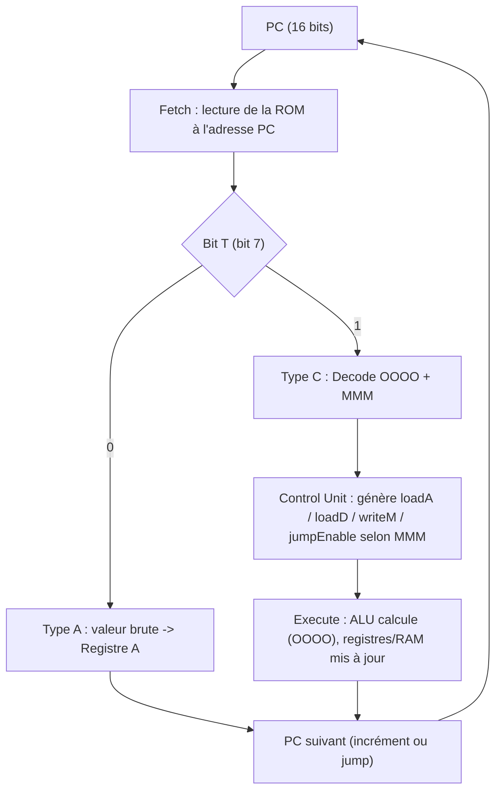

# Spécification du Processeur (Couche 3)

Ce document détaille l'assemblage de l'ALU (Couche 1) et des éléments de mémoire (Couche 2) en un processeur complet, orchestré par une Control Unit et un cycle Fetch/Decode/Execute. Le jeu d'instructions complet (ISA) est spécifié en détail dans `hardware/cpu/ISA.md` ; ce document se concentre sur l'architecture matérielle et le cycle d'exécution qui l'exploitent.

## 1. Contrainte de Conception : Encoder 5 Signaux sur 3 Bits

Sur une instruction de 8 bits, l'ALU à 16 opérations (Couche 1) consomme déjà 4 bits d'opcode, et 1 bit supplémentaire est nécessaire pour distinguer le type d'instruction (adresse ou calcul). Il ne reste donc que **3 bits** pour piloter 5 signaux de contrôle indépendants : la source de l'entrée B de l'ALU, `loadA`, `loadD`, `writeM`, et `jump`.

Plutôt que de câbler ces 3 bits sur des fils individuels (ce qui serait insuffisant pour 5 signaux), ils sont interprétés comme un sélecteur de **mode d'exécution** : chacune des 8 combinaisons possibles préconfigure un profil matériel complet (source des données, destination du résultat, activation ou non du saut). Ce choix d'encodage permet de couvrir tous les cas d'usage nécessaires avec seulement 3 bits, au prix d'une Control Unit qui décode des profils plutôt que des signaux indépendants.

## 2. Format de l'Instruction

Chaque instruction de 8 bits suit le format suivant (voir `ISA.md` pour le détail complet) :

| Bit 7 | Bits 6-3 | Bits 2-0 |
|---|---|---|
| `T` (Type) | `OOOO` (Opcode ALU) | `MMM` (Mode d'exécution) |

- **`T = 0`** : instruction de type A — l'ALU est désactivée, les 7 bits restants sont chargés tels quels dans le registre A.
- **`T = 1`** : instruction de type C — l'ALU est activée ; `OOOO` sélectionne l'opération (voir la table des opcodes de la Couche 1), `MMM` sélectionne le mode d'exécution.

## 3. Aiguillage du Registre A

Le multiplexeur en entrée du registre A choisit entre deux sources : une valeur brute issue de la ROM (instruction de type A), ou le résultat de l'ALU (instruction de type C). Plutôt que de faire transiter ce choix par la Control Unit, il est piloté **directement par le bit `T`** de l'instruction courante, extrait via un splitter :

$$ entr\acute{e}e\_A = MUX(ALU_{sortie},\ ROM_{7:0},\ T) $$

Ce choix évite de surcharger la Control Unit avec un signal déjà disponible sans décodage, puisque `T` est lui-même le bit qui distingue les deux cas.

## 4. Control Unit et Modes d'Exécution (`MMM`)

Lorsque `T = 1`, les 3 bits `MMM` sont décodés par la Control Unit pour produire les signaux `loadA`, `loadD`, `writeM` et `jumpEnable`, selon le profil matériel suivant (détail complet dans `ISA.md`) :

| Mode | Entrée B (ALU) | Destination | Saut |
|---|---|---|---|
| `000` | Registre A | Registre D | Non |
| `001` | RAM[A] | Registre D | Non |
| `010` | Registre A | Registre A | Non |
| `011` | Registre A | RAM[A] | Non |
| `100` | RAM[A] | RAM[A] | Non |
| `101` | Registre A | Aucune | Oui, si sortie ALU ≠ 0 |
| `110` | RAM[A] | Aucune | Oui, si sortie ALU ≠ 0 |
| `111` | Registre A | Registre D **et** Registre A | Non |

L'entrée A de l'ALU est, dans tous les cas, reliée au registre D.

### Saut conditionnel

Les modes `101` et `110` évaluent la sortie de l'ALU : si celle-ci est strictement différente de `00000000`, le PC charge l'adresse contenue dans le registre A. Ces deux modes sont conçus pour être combinés avec les opcodes de comparaison de l'ALU (`CMP_EQ`, `CMP_LT`, `CMP_GT`), qui renvoient précisément `11111111` lorsque la condition testée est vraie — déclenchant ainsi le saut de manière naturelle, sans logique de saut dédiée dans l'ALU elle-même.

## 5. Deux Espaces Mémoire Distincts

Le CPU distingue strictement deux espaces adressables séparément :

- **ROM** (programme) : adressée par le PC sur 16 bits, permettant jusqu'à 65 536 lignes de code.
- **RAM** (données) : adressée par le registre A sur 8 bits, limitant l'espace de données directement manipulable à 256 cases.

Cette asymétrie impose une contrainte structurante mais non bloquante : les sauts (`JUMP`) restent cantonnés aux 256 premières lignes de la ROM (« page zéro »), tandis que le PC continue de s'incrémenter en séquence au-delà pour lire le reste du programme.

Il est important de distinguer le rôle du `JUMP` de celui de l'écriture en RAM : le `JUMP` ne modifie que le PC (donc la position de lecture dans la ROM). Pour écrire une donnée en RAM, le registre A sert directement de broche d'adresse — charger l'adresse dans A, la donnée dans D, puis activer `writeM` (modes `011` ou `100`) suffit ; aucun `JUMP` n'est impliqué.

## 6. Cycle Fetch / Decode / Execute

Le cycle d'exécution est orchestré séquentiellement à chaque front d'horloge, simulé par une méthode `tick()` :

1. **Fetch** : lecture de l'instruction en ROM à l'adresse pointée par le PC.
2. **Decode** : extraction du bit `T` puis, si `T = 1`, des champs `OOOO` (opcode ALU) et `MMM` (mode), et génération des signaux de contrôle correspondants par la Control Unit.
3. **Execute** : calcul du résultat par l'ALU (si `T = 1`) ou chargement direct de la valeur (si `T = 0`), mise à jour des registres et/ou de la RAM selon les signaux de contrôle, puis calcul du PC suivant (incrément ou saut).

## 7. Passage à l'Implémentation Rust

La simulation Rust du CPU sépare clairement :
- **l'état** : registres (A, D), RAM, ROM, PC ;
- **la logique combinatoire** : Control Unit, multiplexeurs, ALU ;

l'ensemble étant orchestré dans une méthode `tick()` qui reproduit le comportement d'un front d'horloge, en enchaînant Fetch, Decode et Execute sur l'état courant.

### Méthodologie de validation

Comme pour les couches précédentes, l'approche "Double-Track" (Logisim + Rust) a permis de valider la Control Unit et le cycle d'exécution complet avant leur intégration dans le CPU final.